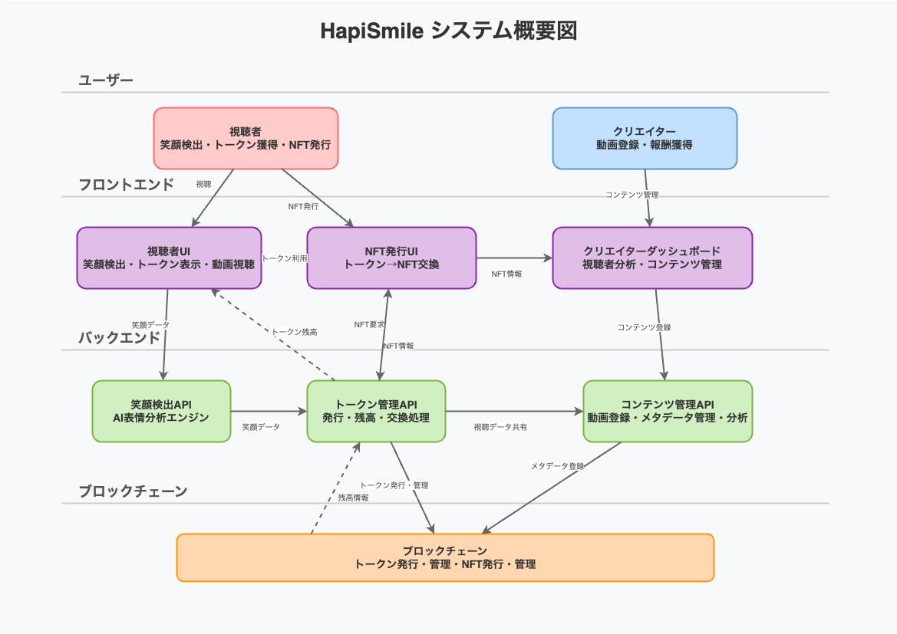

# HapiSmile

## HapiSmileとは？
HapiSmileは、動画を見て笑顔になるだけでトークンが貯まるプラットフォームです。貯めたトークンは特別なNFTやイベント参加など、さまざまな楽しい体験に交換できます。笑顔が新しい価値を生み出す、新感覚のエンターテインメントです。

## 解決する課題
インターネットは本来、人を楽しませ、元気にする場所です。しかし、現状ではネガティブな要素が目立つことも多く、ユーザーの体験を損ねています。

HapiSmileは「笑顔」に注目し、インターネット上で誰もがポジティブな体験を楽しめる環境を目指しています。

## 仕組みと特徴
- **笑顔でトークン獲得**：ユーザーは動画を見るだけで、笑顔の回数や大きさに応じてリアルタイムでトークンが貯まります。
- **NFT交換**：貯めたトークンで特別なNFTやイベント参加権と交換できます。
- **リアルな体験**：限定イベントや特別コンテンツなど、笑顔が生む新しい体験を提供します。

## 得られるメリット
- インターネットのエンタメ体験がポジティブになります。
- 笑顔を自然に引き出すコンテンツが増えます。
- 笑顔をきっかけにした交流が生まれ、コミュニティが活性化します。

## 使用する技術
- **Next.js & React**：動作が軽快で直感的なUI・UXを実現
- **Privy**：簡単かつ安全なウォレット連携を提供
- **MediaPipe Face Landmarker**：リアルタイムでユーザーの笑顔を正確に検出
- **Framer Motion & Tailwind CSS**：滑らかで魅力的なアニメーションやデザインを実装
- **Foundry（スマートコントラクト）**：信頼性と透明性を確保するブロックチェーン技術

## HapiSmileが描く未来
HapiSmileは、世界中の人々が笑顔でつながる新しいインターネットの場所を作ります。

- 笑顔が直接、クリエイターやユーザーへの報酬になる仕組み
- 笑顔がコンテンツの価値を決める指標になる世界
- 世界を越えた新しい「笑顔の経済圏」の誕生

ブロックチェーンの力で「笑顔の循環」を実現し、楽しい未来を共に作りましょう。

# HapiSmile

## What is HapiSmile?
HapiSmile is a platform where you earn tokens simply by smiling while watching videos. The tokens you collect can be exchanged for special NFTs, event participation, and various fun experiences. It's a new form of entertainment that creates value from smiles.

## Problems to Solve
The internet should fundamentally be a place that entertains people and energizes them. However, currently, negative elements often stand out, diminishing the user experience.

HapiSmile focuses on "smiles" and aims to create an environment where everyone can enjoy positive experiences online.

## Mechanism and Features
- **Earning Tokens with Smiles**: Users accumulate tokens in real-time based on the frequency and intensity of their smiles while watching videos.
- **NFT Exchange**: Collected tokens can be exchanged for special NFTs and event participation rights.
- **Real Experiences**: Offers new experiences generated by smiles, such as exclusive events and special content.

## Benefits
- Internet entertainment experiences become more positive.
- Content that naturally draws out smiles increases.
- Interactions triggered by smiles emerge, revitalizing communities.

## Technologies Used
- **Next.js & React**: Achieving lightweight and intuitive UI/UX
- **Privy**: Providing simple and secure wallet integration
- **MediaPipe Face Landmarker**: Accurately detecting users' smiles in real-time
- **Framer Motion & Tailwind CSS**: Implementing smooth and attractive animations and designs
- **Foundry (Smart Contracts)**: Ensuring reliability and transparency through blockchain technology

## The Future Envisioned by HapiSmile
HapiSmile creates a new internet space where people around the world connect through smiles.

Specifically, it will realize:
- A mechanism where smiles directly become rewards for creators and users
- A world where smiles become the metric determining content value
- The birth of a new "smile economy" that transcends global boundaries
- A highly transparent reward distribution system through blockchain, achieving fairness in entertainment
- Creating new communities using smile NFTs and experiences that connect real and virtual worlds

Let's create a joyful future together by realizing a "cycle of smiles" through the power of blockchain.
